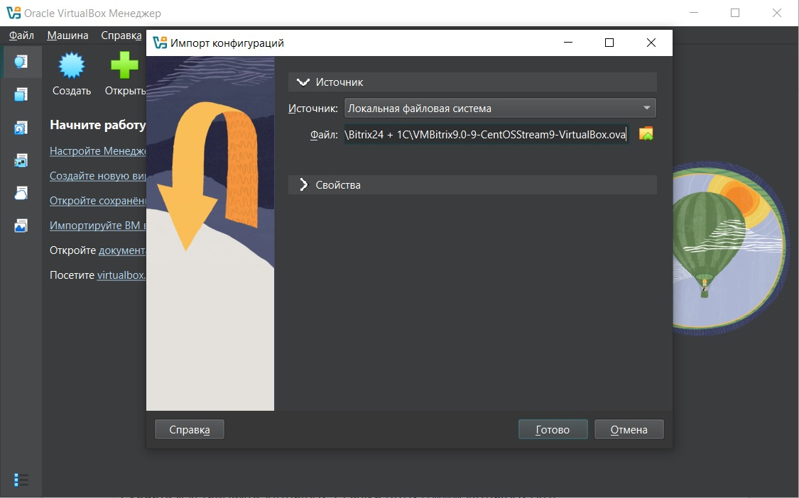
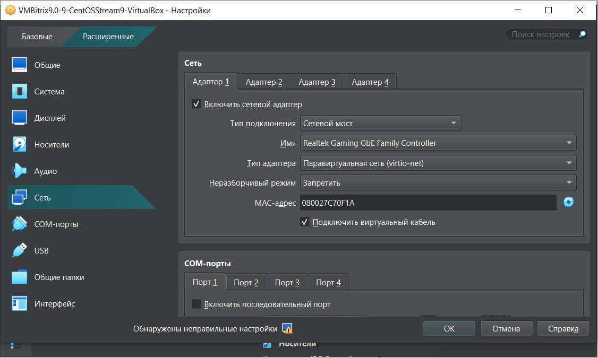
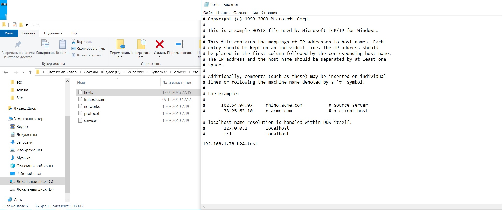

# 1. Подготовка хостовой системы

## Установка VirtualBox

1. Скачать дистрибутив VirtualBox с официального сайта: [https://www.virtualbox.org/](https://www.virtualbox.org/)
2. Выполнить установку, следуя инструкциям мастера.

## Импорт образа BitrixVM

1. Скачать образ виртуальной машины: [VMBitrix9.0-9-CentOSStream9-VirtualBox.ova](https://repo.bitrix24.tech/vm/VMBitrix9.0-9-CentOSStream9-VirtualBox.ova)
2. В VirtualBox выбрать **Файл → Импорт конфигураций** (Ctrl+I)
3. Указать путь к скачанному файлу `.ova`
4. Нажать **Готово** — все необходимые настройки уже прописаны в образе

   

## Настройка сетевого адаптера

Для корректной работы Битрикс24 и доступа к виртуальной машине по доменному имени `b24.test` необходимо настроить сетевой адаптер в режиме **Сетевой мост (Bridged)**. Режим NAT не подходит, так как скрывает виртуальную машину за сетевым адресом хоста.

**Порядок настройки:**
1. Выбрать виртуальную машину → **Настроить** → **Сеть**
2. **Тип подключения:** Сетевой мост
3. **Тип адаптера:** Паравиртуальная сеть (virtio-net). Повышает стабильность, нет конфликтующих драйверов
4. Нажать **OK**

   

*Если появляется предупреждение «Обнаружены неправильные настройки», его можно игнорировать.*

## Первый запуск и смена паролей

1. Запустить виртуальную машину
2. После загрузки на экране отобразятся:
   - IP-адрес виртуальной машины
   - Пароль root по умолчанию
3. **Записать IP-адрес** — он понадобится для настройки файла `hosts`

   > [!WARNING]
   >  
   >**Важно:** Не рекомендуется заходить в Битрикс24 по IP-адресу. В некоторых случаях это может нарушить корректный доступ к репозиториям.

4. Войти в систему:
   - Логин: `root`
   - Пароль: (указан на экране)

5. Система запросит смену пароля root — задать новый и запомнить его
6. После этого будет предложено задать пароль для пользователя `bitrix` — также запомнить

## Настройка доменного имени

Для доступа к сайту по доменному имени `b24.test` необходимо добавить запись в файл `hosts` на хостовой машине:

**Путь:** `C:\Windows\System32\drivers\etc\hosts`

Открыть файл от имени администратора и добавить строку:
```text
<IP_адрес_виртуальной_машины> b24.test
```



После этого можно приступать к настройке BitrixVM.
