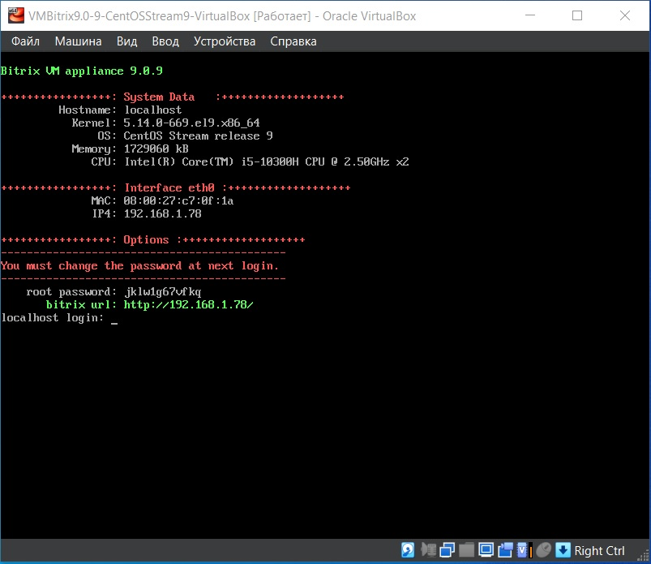
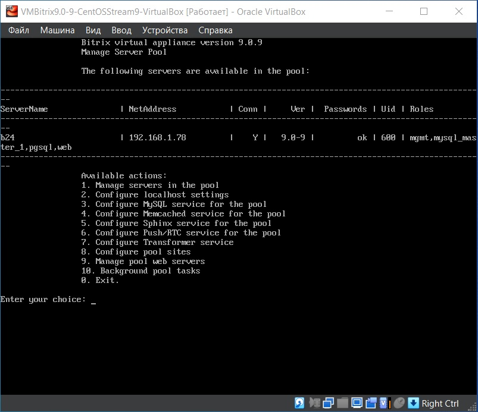
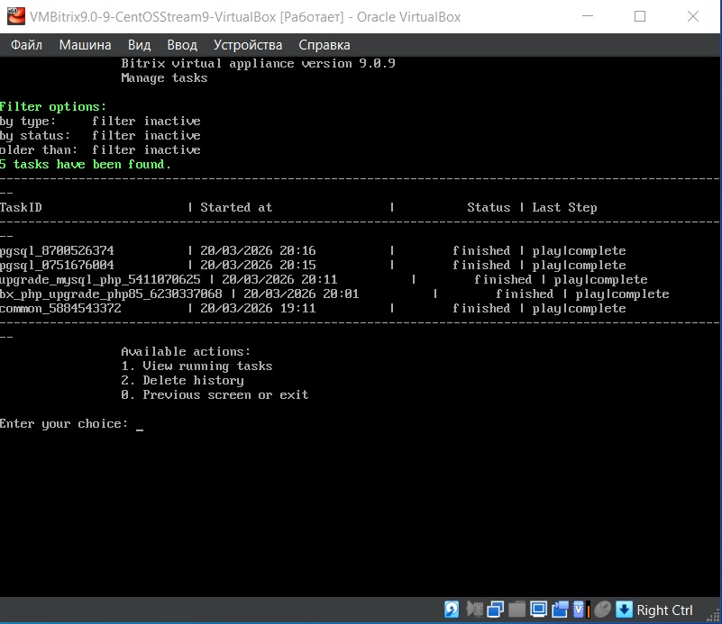

# 2. Настройка BitrixVM

После первого запуска и смены паролей открывается меню настройки BitrixVM.



## Обновление операционной системы

1. Выйти из меню, выбрав пункт **0. Exit**
2. Выполнить обновление пакетов:
   ```bash
   dnf update -y
   ```
3. Вернуться в меню:

    ```bash
    /root/menu.sh
    ```
## Создание пула управления
 1. Выбрать пункт `1. Create management pool on the server`

 2. Ввести имя пула (например, b24)

 3. Дождаться сообщения `Pool has been created successfully`

### Задача common (базовая настройка системы)
После создания пула автоматически запускается фоновая задача common (роль Ansible). Она выполняет:

 - Открытие необходимых портов в фаерволе (80, 443, 22, 8890–8894)

 - Настройку синхронизации времени (NTP)

 - Установку базовых пакетов (wget, curl и др.)

 - Приведение имени хоста к имени сервера в пуле

 - Проверку доступности репозиториев

#### Проверка статуса задачи:

```bash
tail -f /opt/webdir/temp/common_*/status
```
Также статус можно посмотреть через основное меню `10. Background pool tasks`.

Успешное завершение **common** — обязательное условие для дальнейшей работы. При возникновении ошибок см. раздел Устранение неполадок.



## Обновление компонентов

### PHP
В меню: `1. Manage servers in the pool → 6. Update PHP, MySQL, PostgreSQL`

1. Ввести имя сервера (из пула) или указать all

2. Выбрать Upgrade PHP to version 8.4 (или 8.5)

3. Подтвердить обновление (y)

После завершения обновления (статус finished в пункте 10 меню) рекомендуется перезапустить веб-сервер:

```bash
systemctl restart httpd
systemctl status httpd
```
### etckeeper (обязательно перед MySQL)

Перед обновлением MySQL необходимо инициализировать etckeeper:

```bash
etckeeper init
```
Появится сообщение **[hooks]** — это нормально.

### MySQL
1. Вернуться в меню:

    ```bash
    /root/menu.sh
    ```
2. Перейти 1 → 6 → 3. Upgrade MySQL

3. Выбрать обновление до версии 8.4

4. Дождаться завершения

### PostgreSQL
1. Перейти 1 → 6 → 4. Upgrade PostgreSQL to version 15

2. После успешного обновления станет доступна версия 16 — обновить дважды



### Завершение настройки

1. Выйти из меню (0. Exit)

2. Выполнить финальное обновление:

    ```bash
    dnf update -y
    reboot
    ```
### Управление питанием виртуальной машины
Для предотвращения проблем с MySQL, сетью и файловой системой не рекомендуется выключать виртуальную машину через закрытие окна VirtualBox.

**Правильные способы:**

**Перезагрузка:** в меню BitrixVM → 2. Configure localhost settings → 4. Reboot server

**Выключение:** в меню BitrixVM → 2. Configure localhost settings → 5. Shutdown server

Только после этого можно закрывать окно VirtualBox или выключать хост-компьютер.