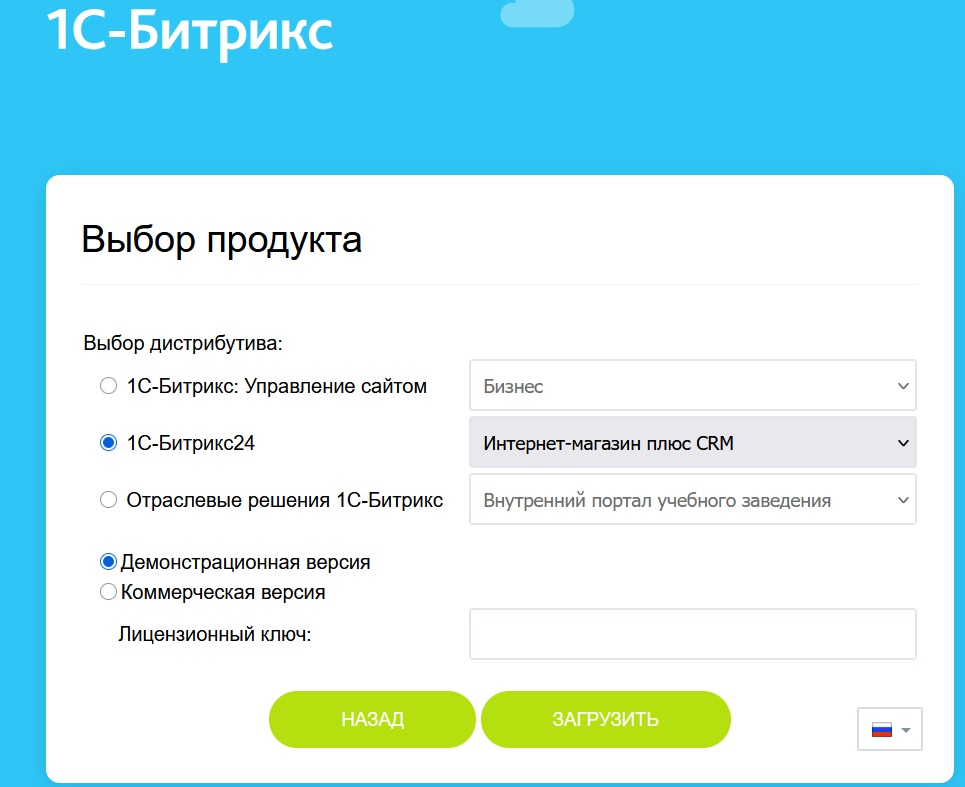
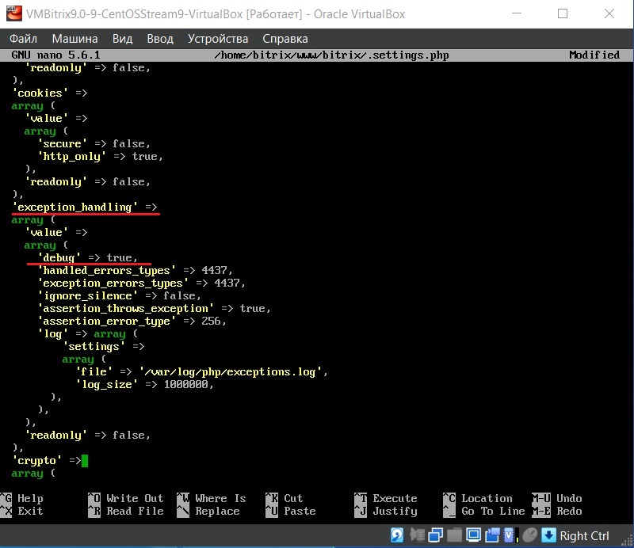
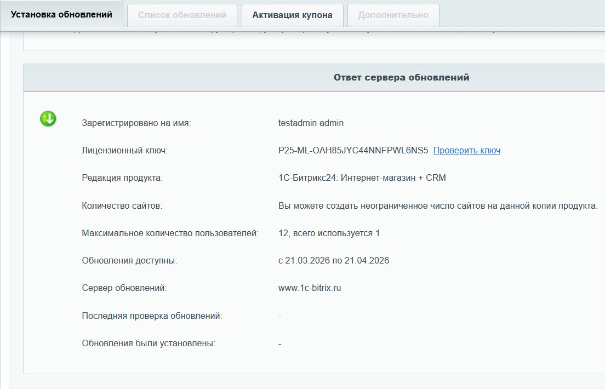

# 3. Установка Битрикс24

## Скачивание скрипта установки

```bash
cd /home/bitrix/www/
wget https://www.1c-bitrix.ru/download/scripts/bitrixsetup.php
```
## Запуск мастера
В браузере открыть:
```text
http://b24.test/bitrixsetup.php
```
**Порядок действий в мастере:**

1. Выбрать «1С-Битрикс24: Интернет-магазин + CRM», Демонстрационная версия

    

2. Нажать «Загрузить» — начнётся загрузка дистрибутива

3. Принять лицензионное соглашение

4. Заполнить форму регистрации продукта (имя, фамилия, email)

5. Дождаться установки продукта

6. Создать администратора портала (логин и пароль запомнить)

7. Пройти начальные настройки (можно принять значения по умолчанию)

8. Нажать «Перейти в Битрикс24»

## Включение режима отладки (опционально)
Для отслеживания ошибок при обновлениях рекомендуется включить **debug mode:**

```bash
dnf install nano -y
nano /home/bitrix/www/bitrix/.settings.php
```
Найти секцию **`exception_handling`** и изменить:

```php
'debug' => true,
```



> [!CAUTION]
> Важно: После завершения работы вернуть 'debug' => false. Режим отладки замедляет работу сайта.

## Доступ к административной панели
```text
http://b24.test/bitrix/admin/
```
Логин и пароль — указанные при создании администратора.

## Проверка лицензии и обновление платформы

В админке: `Marketplace → Обновления платформы`

В разделе **«Ответ сервера обновлений»** проверить наличие лицензионного ключа и корректность редакции



В самом верху нажать **SiteUpdate**, затем **«Установить рекомендуемые обновления»**

### Типовая ошибка при обновлении
При первом обновлении на ~25% возникает ошибка:

```text
e>[Error] Interface "Bitrix\Booking\Interfaces\ProviderInterface" not found (0)
```
**Причина:** Модуль «Бронирование» (booking) пытается установиться раньше зависимых модулей (crm, main). Это баг последовательности обновлений, не связанный с настройками сервера.

**Решение:** Нажать «Проверить обновления» и повторно «Установить рекомендуемые обновления». Со второго раза обновление проходит успешно (подробнее в [Устранение неполадок](06-troubleshooting.md)).

## Обновление решений
Проверить наличие установленных решений: `Marketplace → Установленные решения`

Должны быть: **«Корпоративный сайт услуг»** и **«Современный интернет-магазин»**

Перейти в `Marketplace → Обновление решений` и установить рекомендованные обновления