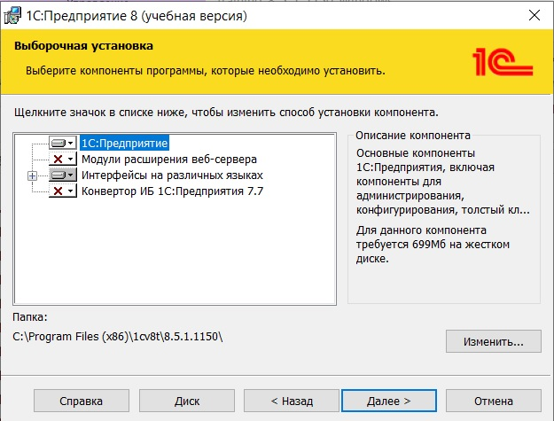
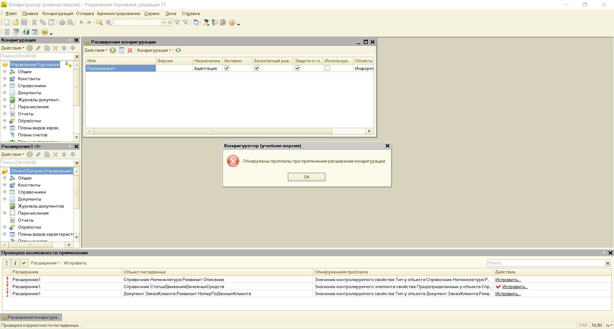
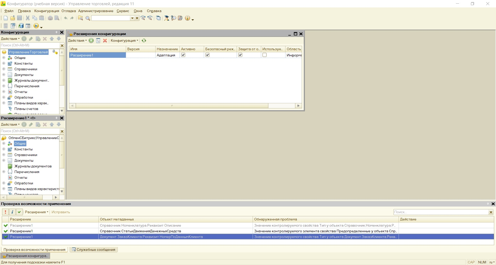
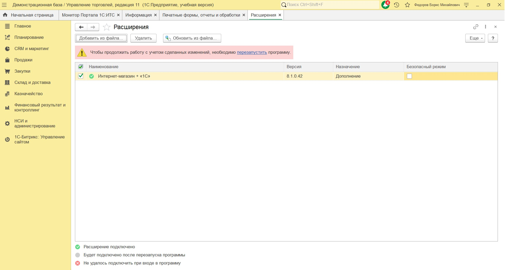
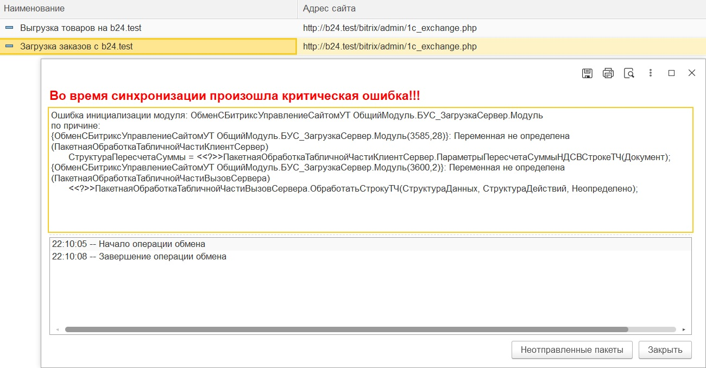
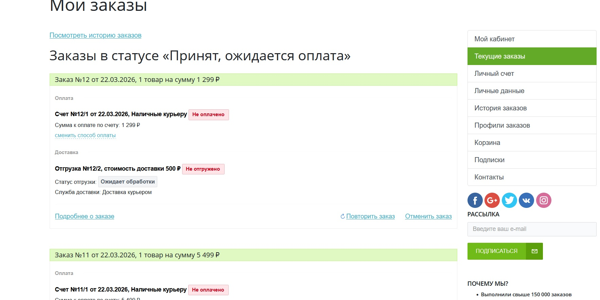

# 5. Настройка интеграции с 1С

## Проверка складского учёта

В админке Битрикс24:
**Настройки → Настройки продукта → Настройки модулей → Торговый каталог → вкладка «Складской учёт»**

Флаг **«Включить складской учёт»** должен быть активен (включается автоматически при создании магазина).

## Создание пользователя для 1С

1. **Настройки → Пользователи → Список пользователей → Добавить пользователя**
2. Заполнить:
   - **Логин:** `1c_exchange`
   - **Пароль:** (записать)
   - **E-mail:** любой
3. В разделе **«Группы»** выбрать **«Администраторы»**
4. Сохранить

## URL для обмена
```text
http://b24.test/bitrix/admin/1c_exchange.php
```

## Скачивание модуля обмена

Скачать модуль с официального сайта:  
[https://1c.1c-bitrix.ru/ecommerce/download.php?id=27756770](https://1c.1c-bitrix.ru/ecommerce/download.php?id=27756770)

## Установка 1С:Предприятие (учебная версия)

1. Скачать дистрибутив: [ссылка](https://online.1c.ru/catalog/free/28765768/)
2. Выполнить установку с настройками по умолчанию



## Подключение демо-базы «Управление торговлей»

1. Скачать архив: [utdemo11.5.11.zip](https://fserver.1c.ru/its/files/demo/books/utovio/utdemo11.5.11.zip)
2. Распаковать в отдельную папку (например, `C:\1C_Demo\Trade\`)
3. Запустить 1С:Предприятие
4. При появлении диалога «Список информационных баз пуст» нажать **«Да»**
5. Выбрать **«Добавление в список существующей информационной базы»**
6. Указать имя базы (например, «Управление торговлей (тест)»)
7. Тип расположения: **На данном компьютере** (выбран по умолчанию)
8. Указать путь к распакованной папке с файлом `1Cv8.1CD`
9. Завершить добавление

## Установка модуля обмена (расширения .cfe)

### Конфигуратор

1. Запустить 1С:Предприятие, выбрать **Конфигуратор**
2. Логин: `Администратор (ФедоровБМ)`, пароль: пустой
3. В меню: **Конфигурация → Открыть конфигурацию** (если не открыта)
4. **Конфигурация → Расширения конфигурации**
5. Нажать **«+»** (Добавить), имя можно оставить по умолчанию
6. В списке расширений выбрать созданное, нажать ПКМ → **Конфигурация → Загрузить конфигурацию из файла**
7. Выбрать файл `BMS_RU_UT.cfe` из скачанного архива
8. Подтвердить. На вопрос об обновлении конфигурации базы данных ответить «Да»

### Разрешение конфликтов

1. Появится сообщение «Обнаружены проблемы при применении расширения конфигурации». Нажать **ОК**

   

2. Откроется окно «Проверка возможности применения» — три конфликта
3. Для каждого конфликта выбрать `действие` **«Исправить → Установить значение из объекта конфигурации»**
4. После устранения всех конфликтов появятся зелёные галочки

   

5. В меню: **Конфигурация → Обновить конфигурацию базы данных** (F7) → Принять
6. Закрыть Конфигуратор (сохранить изменения)

### Активация расширения

1. Запустить 1С:Предприятие
2. В левом меню должен появиться раздел **«1С-Битрикс: Управление сайтом»**
3. Перейти: **НСИ и администрирование → Печатные формы, отчеты и обработки → Расширения**
4. Найти установленное расширение и **снять галочку «Безопасный режим»**

   

5. Перезагрузить 1С

## Настройка обмена в 1С

Раздел: **1С-Битрикс: Управление сайтом → Настройки обмена с сайтами**

### Подключение для выгрузки товаров

1. **Создать подключение к БУС**
2. **Имя:** `Выгрузка товаров на b24.test`
3. **Назначение:** `Выгружать на сайт`
4. **Адрес сайта:** `http://b24.test/bitrix/admin/1c_exchange.php`
5. **Пользователь/пароль:** созданные ранее для 1С
6. **Проверить соединение** — должно быть успешным
7. **Режим обмена данных:** оставить `Выгрузка информации о номенклатуре`
8. Нажать **«Настроить»**:
   - **Товары** → **Заполнить по умолчанию**
   - **Цены** → добавить «Розничная»
   - Применить и закрыть
9. Записать и закрыть

### Подключение для загрузки заказов

1. **Создать подключение к БУС**
2. **Имя:** `Загрузка заказов с b24.test`
3. **Адрес, логин, пароль** те же
4. **Проверить соединение**
5. **Режим обмена данных:** снять `Выгрузка информации о номенклатуре`, включить **«Обмен документами»**
6. Перейти в **настройки обмена документами**

**Общие настройки → Настроить загрузки контрагентов:**
- **Контрагент:** Розничный покупатель
- **Соглашение контрагента физлицо:** Продажа в розницу
- **Группа для новых партнеров:** Розничный покупатель
- Применить и закрыть

**Настройка отгрузок:**
- Включить флаги **«Загружать отгрузки»** и **«Выгружать отгрузки»**

7. Записать и закрыть

## Выполнение обмена

### Выгрузка товаров
1. Выбрать подключение для выгрузки товаров
2. Нажать **«Выполнить обмен с сайтом»**
3. Дождаться завершения

При первом обмене возможна ошибка по единицам измерения (например, для кода `м2`). Ошибка не критична — обмен происходит.

### Загрузка товаров
1. Выбрать подключение для загрузки заказов
2. Выполнить обмен

При обмене заказов возникает ошибка, связанная с ограничениями учебной версии 1С (отсутствие клиент-серверного режима). Это ожидаемое поведение — см. раздел [Устранение неполадок](06-troubleshooting.md).



## Проверка статусов

После успешной интеграции в разделе сайта «Мои заказы» (при наличии оформленных заказов) отображаются актуальные статусы — это подтверждает работоспособность обмена.

